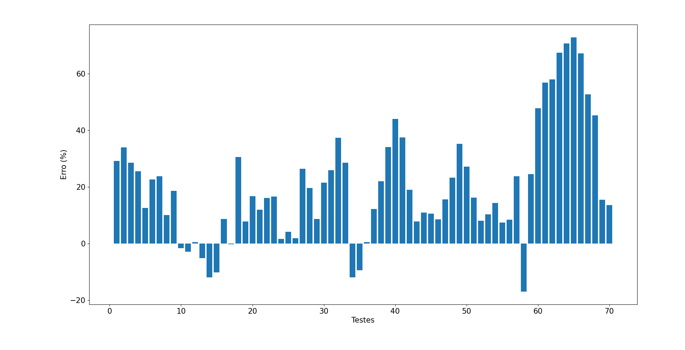

# Correlação de BEGGS e BRILL (1973) Implementada em Python #

Os arquivos do presente repositório possuem a correlação de BEGGS e BRILL (1973) implementada em Python, sendo o código utilizado para a previsão de queda de pressão e do hold up de líquido em escoamentos multifásicos. A correlação de BEGGS e BRILL (1973) consiste em uma ferramento versátil, uma vez que permite simular o escoamento multifásico para todos os ângulos de inclinação do tubo. Deste modo, o código, além de realizar o cálculo da queda de pressão e do hold up de líquido, também determina o regime de escoamento em questão (segregado, intermitente, distribuído ou de transição).

Dentre os arquivos presentes neste repositório, o arquivo multiphase_equations.py guarda as variáveis de entrada, sendo tais variáveis:

- Vazão volumétrica de gás;
- Vazão volumétrica de líquido;
- Diâmetro do tubo;
- Rugosidade do tubo;
- Densidade do líquido;
- Massa molar do gás;
- Tensão superficial;
- Aceleração da gravidade;
- Ângulo de inclinação do tubo;
- Elevação do tubo;
- Comprimento do tubo;
- Temperatura;
- Pressão de entrada.

O usuário do código deve fornecer os valores de tais variáveis de entrada para o cálculo da queda de pressão e do hold up de líquido. Assim, além de conter as variáveis de entrada, o arquivo multiphase_equations.py também contém as equações da correlação de BEGGS e BRILL (1973). Quanto aos arquivos payne-Pdrop.csv e payne-Holdups.csv, estes contém valores das variáveis de entrada retiradas do artigo de PAYNE et al. (1979) para validação da correlação. Deste modo, as variáveis de entrada do arquivo payne-Pdrop.csv são utilizadas para cálculo de queda de pressão e posterior comparação com dados experimentais retirados do artigo. Já as variáveis de entrada do arquivo payne-Holdups.csv são utilizadas para cálculo do hold up de líquido e posterior comparação com dados experimentais retirados do artigo. Com isto, o arquivo multiphase_equations.py pode utilizar os dados dos arquivos payne-Pdrop.csv e payne-Holdups.csv como variáveis de entrada para a validação. Em relação ao arquivo execute_teste.py, este é o arquivo que realiza o cálculo da queda de pressão e do hold up de líquido em uma tubulação utilizando as equações do arquivo multiphase_equations.py e as variáveis de entrada fornecidas, além de determinar os regimes de escoamento. Desta forma, tomando-se os dados dos arquivos payne-Pdrop.csv e payne-Holdups.csv como variáveis de entrada, o arquivo execute_teste.py produz gráficos comparativos entre valores de queda de pressão calculados e experimentais, bem como entre valores de hold up de líquido calculados e experimentais. Por fim, o arquivo test.py produz um gráfico com escala de cores, cuja finalidade é a verificação da influência das variáveis de entrada na queda de pressão a partir das equacões implementadas no arquivo multiphase_equations.py.

De posse dos arquivos deste repositório, ao se executar o arquivo execute_teste.py, uma das figuras obtidas é a figura abaixo. Nela, o eixo das abscissas representa os diversos testes realizados para determinação da queda de pressão, enquanto o eixo das ordenadas representa os respectivos valores de queda de pressão. A curva azul é referente aos valores de queda de pressão calculados, enquanto que a curva laranja é referente aos valores experimentais do arquivo payne-Pdrop.csv. Assim, verifica-se uma predominancia dos maiores valores de queda de pressão nos primeiros testes realizados, e dos menores valores nos últimos. Também é possível verificar que as curvas possuem maior proximidade, até mesmo se sobrepondo, nos testes 5 a 25, 52 a 60 e 68 em diante, indicando menores erros absolutos entre os valores calculados e experimentais de queda de pressão em tais testes. Nos demais testes, as maiores diferenças provavelmente ocorrem devido às aproximações realizadas no cálculo, como considerar o gradiente de pressao como sendo independente do comprimento, e às limitações da própria correlação de BEGGS e BRILL (1973), como o fato de se tratar de um modelo homogêneo, ou seja, há uma aproximação simplificada na qual as fases gás e líquida são tidas como uma única fase, sendo esta fase única um sistema pseudo-monofasico.

Em relação à próxima figura, esta se trata de um gráfico de barras que mostra o erro relativo entre os valores de queda de pressao calculados e experimentais para cada teste realizado. Neste gráfico, os erros relativos inferiores a 20% ocorrem predominantemente nos testes 9 a 17, 19 a 26 , 34 a 37, 42 a 47 e 51 a 56. E possível observar que o erro relativo é maior para os últimos testes realizados pois, conforme foi observado na figura anterior, menores valores de queda de pressão podem ser observados para os últimos testes realizados e, desta forma, os erros relativos tendem a ser maiores quando um mesmo erro absoluto ocorre para menores valores se comparados a valores maiores. Os erros percentuais maiores também se justificam devido às aproximações de cálculo e limitações relacionadas à correlação adotada, conforme foi dito anteriormente.

Por fim, a figura abaixo apresenta outro gráfico comparativo entre os valores de queda de pressão calculados e experimentais. Os pontos vermelhos sãoo referentes aos valores calculados, enquanto que os pontos verdes representam os valores experimentais. E possível verificar que ocorre um maior afastamento entre os pontos verdes e vermelhos em valores de queda de pressão mais elevados, indicando maior erro absoluto para tais valores, o que pode ser observado também na primeira figura apresentada na qual, para os primeiros testes feitos, houve maior distanciamento entre as curvas azul e laranja. O distanciamento entre os pontos vermelhos e verdes da figura abaixo também podem ser atribuídos a aproximações de cálculo e às limitações da correlação de BEGGS e BRILL (1973).

Com isto, apesar das diferenças entre os valores de queda de pressao calculados e experimentais observadas nas figuras anteriores, pode-se afirmar que tais diferenças são toleráveis, uma vez que erros relativos da ordem de 20% são reportados em trabalhos de correlações de escoamento multifásico e considerados como aceitáveis.

Uma última figura que pode ser obtida a se executar o arquivo execute_teste.py é a figura abaixo, na qual há seis gráficos comparativos entre os valores de holdup de líquido medidos e calculados, sendo um para cada seção de escoamento. Na figura, os pontos vermelhos correspondem aos valores calculados, enquanto os pontos verdes representam os valores experimentais do arquivo payne-Holdups.csv. É possível verificar que, nos gráficos referentes às seções 1, 3 e 4, os pontos verdes e vermelhos possuem maior proximidade, enquanto que nos gráficos referentes às seções 2, 5 e 6 tais pontos estão mais afastados. A discordância entre os valores de holdup de líquido medidos e calculados nas seções 2, 5 e 6 pode ser devido ao fato de que, apesar de o cálculo do holdup não incluir as aproximações feitas para a queda de pressão, ainda pode haver influência das limitações relativas à própria correlação de BEGGS e BRILL (1973), como o fato de se tratar de um modelo homogeneo.

Por fim, executando-se o arquivo test.py, analisou-se a influência de algumas variáveis de entrada na queda de pressão. Desta forma, foram selecionados o ângulo de inclinação do duto e a fração volumétrica de gás na entrada, a qual corresponde à razão entre a vazão volumétrica de gás e à vazão volumétrica total. A escolha do ângulo de inclinação ocorreu porque, no desenvolvimento da correlação de Beggs e Brill (1973), seu efeito foi investigado no holdup de líquido e na queda de pressão. Já a escolha da fração volumétrica de gás se deu devido ao fato de que as vazões volumétricas de gás e de líquido, juntamente com o diâmetro do duto, são as variáveis de entrada que possuem influência no regime de escoamento. Sendo assim, gerou-se um gráfico com escala de cores, no qual o eixo x corresponde à fração volumétrica de gás, o eixo y corresponde ao ângulo de inclinação, e a variação de pressão é representada pelas cores no gráfico, sendo que, para uma dada região do gráfico, quanto mais a cor desta região se aproxima do amarelo na escala de cores à direita, maior é a variacão de pressão no sentido positivo, enquanto que, quanto mais a cor se aproxima do azul escuro, maior é a variação de pressão no sentido negativo. Com isto, foi obtido o gráfico da figura abaixo.

